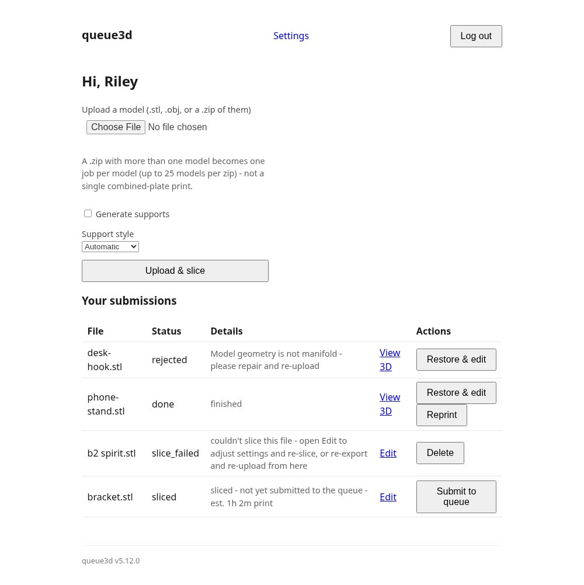
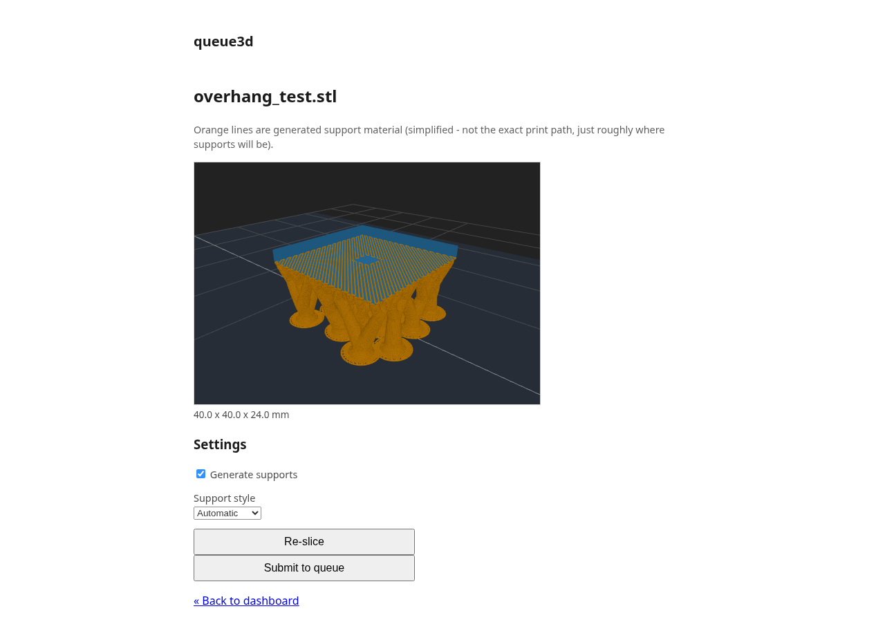
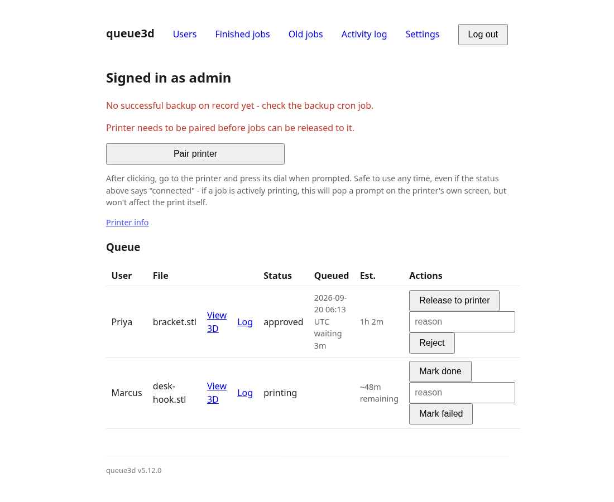
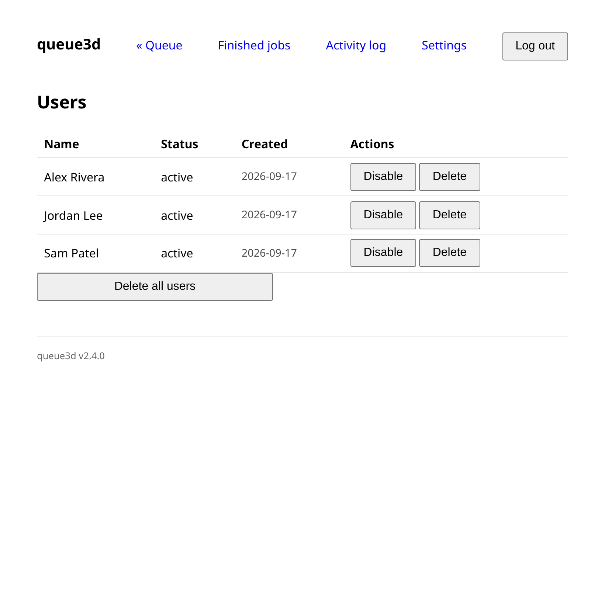

# queue3d

Do you have a shared local 3D printer? If so, queue3d lets users upload and
slice their own models and submit them to a queue. An admin reviews each
submission and releases approved jobs to the printer when ready.

**Printer support:** only the MakerBot Replicator+ (with a Tough Smart
Extruder+) is supported at this time, over its reverse-engineered network
protocol - see `test-print/README.md`. No other printer models or brands
are supported yet.

## Screenshots

Sample data below (names, filenames, queue contents) - not a real
deployment.

**User view** - uploading a model and tracking submissions through the
queue:

The interactive 3D preview, here showing a model alongside its generated
support material:

**Admin view** - reviewing the queue and approving, rejecting, or releasing
jobs to the printer:

Managing user accounts:

## Features

- **Self-serve user accounts** - sign up with just a name and PIN, no
  email or password reset flow.
- **Admin accounts** provisioned separately (no self-service admin
  signup) - reviewing and releasing jobs is a position of trust over
  shared printer time.
- **User account management** - any admin can disable/re-enable or
  permanently delete a user's account, individually or all at once;
  disabling blocks login immediately, even from an already-open session.
  Deleting is blocked while that user still has an unfinished job.
- **Upload and automatic slicing** - submit an STL, it's sliced
  server-side (OrcaSlicer + a patched `mbotmake`) into a print-ready file,
  no separate slicer software needed on the user's end.
- **Live upload and slicing progress** - a byte-transfer progress bar while
  the file is being received, and a "slicing…" indicator on the dashboard
  (self-updating, no page reload) while it's converted server-side -
  slicing runs in the background rather than leaving the page hanging for
  however long that takes.
- **Slicing and submitting are separate actions** - uploading slices a
  model into a private draft (never visible to admins or counted in the
  queue) that can be re-sliced in place with different support settings,
  as many times as wanted, before deciding to submit it to the shared
  queue. A draft nobody ever submits expires automatically after an
  admin-configurable number of days (`/admin/settings`).
- **Live duration estimate and queue position** shown to the submitter as
  soon as slicing finishes.
- **Interactive 3D preview** - rotate and zoom a model on the real build
  plate before submitting (entirely in the browser, no upload needed just
  to look at it), and again afterward on the job's own page (for the
  submitter and for an admin reviewing it), this time showing generated
  support material as an overlay if supports were enabled for that job.
- **Choice of support style** - Automatic, Grid, Snug, Organic, or one of
  two tree-support variants, matching the shapes PrusaSlicer users would
  recognize by the same names.
- **One shared queue** - submissions land directly in it; there's no
  separate pre-review step before something counts as queued.
- **Admin review** - approve, or reject with a required note explaining
  why, before anything reaches the printer.
- **Browse finished jobs and a full audit log** - a rejected/done/failed/
  expired job leaves the live queue view but stays reachable
  (`/admin/jobs/finished`). A global activity log (`/admin/log`) shows
  every submit, slice attempt, re-slice, queue-submit, approve, reject
  (with the note), release, and outcome, across every job, most recent
  first, at a glance - plus each job's own history on its own page
  (`/admin/jobs/{id}/log`, linked from the queue, the finished-jobs list,
  and the global log).
- **Release to the printer over the network** - an approved job is sent
  and started directly; no walking a file over on a flash drive.
- **One job on the printer at a time**, enforced - releasing a second job
  while one is already printing is blocked with a clear error.
- **Automated backups** - the database and finished-job archive back up
  automatically on a schedule, rotating between two targets, with a
  dashboard indicator if a backup hasn't run recently.
- **Built for offline deployment** - runs entirely on a local network with
  no internet access required; no CDN dependencies.
- **App version number** shown as a footer on every page, read from
  `app/VERSION` at startup - bump that file to change what's shown, no code
  change needed.

## To do

**Security & CI**
- A pipeline to run security checks automatically (e.g. dependency
  vulnerability scanning, static analysis, secret scanning) rather than
  relying on manual review.

**Upload**
- Accept file types beyond `.stl` - `.3mf`, `.obj`, and `.zip` (presumably
  a zipped model file) were specifically asked for.
- Model repair (like PrusaSlicer/OrcaSlicer's "Fix through Netfabb") -
  confirmed OrcaSlicer's CLI has no repair flag to lean on (that's a
  GUI-only feature there), so this would mean a dedicated repair pass
  before slicing - `trimesh` (Python, fill holes/fix normals/fix winding)
  or `admesh` (a small purpose-built STL repair CLI) are the two realistic
  options to build it on.

**Job review & feedback**
- Show failure reasons to the user, not just rejection notes - rejection
  notes already display (required, and shown on the user's dashboard); a
  failed print currently has no reason at all (`mark_failed` only flips
  status, no note field), and slicing-error detail is currently only
  visible to an admin (as a hover tooltip), never shown to the user.
- Break the estimated print duration into days/hours/minutes - it's
  currently total minutes only.
- Show the date/time a job was submitted, and how long it's been sitting
  in the queue since (days/hours/minutes) - the timestamp is already
  recorded (`Job.created_at`/`queued_at`), it's just not displayed
  anywhere yet.
- Let admins configure an age threshold (e.g. 30 days) and split
  still-waiting jobs into two separate views by it: the normal queue view
  for anything younger than the threshold, and a separate "old jobs" view
  for anything at or past it - mutually exclusive, not shown in both.
  Builds directly on the submitted-at timestamp/duration-in-queue item
  above. Open question: does this apply only to `queued`/`approved` jobs
  (still awaiting a decision), or also to ones that are `printing` (already
  being acted on, so arguably shouldn't count as stale backlog). Jobs in
  this "old jobs" view should have an admin delete option - see "Audit
  log" below, since that delete has to be logged like any other change.
- Let a user restore an archived model (`slice_failed`, `rejected`,
  `failed`, or `done` - any job whose files ended up in `archive/`) back
  into their working space to modify and resubmit, rather than only being
  able to start over from scratch - useful both for fixing a failed/rejected
  submission and for reprinting or tweaking a past successful one. A
  restored resubmission goes to the end of the queue, not back to where the
  original was - it's a new submission, and the admin still decides when to
  release it like any other. Should copy the archived files rather than
  move them, so the original archived record/history isn't lost.
- The "View 3D" page (`/jobs/{id}/preview`) is view-only today - no way to
  resize a model or change its support settings (enable/style) from there,
  only at initial upload. This is really the same gap as the resize
  controls and restore-a-model items above, just noting where users will
  actually look for it: on the job's own page, not just at upload time or
  after it's already failed/been rejected. Open question this raises: for
  a job that's still active (`queued`/`approved`, not yet released) should
  changing something here re-slice it in place, keeping its position in
  the queue, or does any edit count as a new submission that goes to the
  end like a restored one does - those are different user expectations and
  worth deciding deliberately rather than defaulting to whichever is
  easier to build.
- Let a user delete their own model from the queue (they may no longer
  want it) - with a clear warning first that this is permanent: it removes
  the job from the queue/list and deletes the model files, with no undo.
  Only allowed while a job is still `queued`/`approved` (before release) -
  once it's released and `printing`, the delete action is disabled/removed
  from the list; the job's status just updates normally from there
  (`done`/`failed`) like any other. Deleting does not need to also remove
  the job from any backup already taken before the delete. Like any other
  change to a job, this needs to be recorded in the job log - see "Audit
  log" below.

**Audit log**
- The core log is built (`models.JobEvent`; `/admin/log` - one global,
  most-recent-first table across every job, which is the actual "admin
  log view"; `/admin/jobs/{id}/log` for one job's own history) - see
  Features below.
- Filters for the global log (`/admin/log`) - by job, user/admin, action
  type, date range. Explicitly deferred by the user rather than built
  alongside the log itself; currently just capped at the 500 most recent
  entries with no way to narrow that down.
- Once the two delete features above (a user deleting their own queued
  model, an admin deleting an old one) actually exist, each needs its own
  log entry too, and an admin deletion specifically must say who did it -
  the log doesn't have anything to log yet for actions that don't exist.

**Backups & recovery**
- Let admins see a list of backups taken and a manifest of what's actually
  in each one. Presentation undecided (a subpage, a pop-up list, something
  else). Restoring an individual model doesn't need this - see "restore an
  archived model" under Job review & feedback, which works directly off
  `archive/` instead; this is about visibility into the database-level
  backups themselves (see `backup.py`), for confirming they're actually
  capturing what's expected.

**Print options**
- Color selection for users - 1st/2nd/3rd preference, chosen from a
  dropdown populated by an admin-managed list of colors (admins check or
  uncheck which colors are currently available, based on inventory).
- Controls for resizing a model before submitting.

**Appearance**
- Light/dark theme, with a toggle.
- Selectable themes - not just wallpaper/background/color, but ones that
  change the page layout itself, not only its palette.

**Printer**
- Live print progress/status while a job is printing - `mark_done`/
  `mark_failed` are still a manual admin action; the printer's protocol
  has a status-notification mechanism that isn't consumed yet.
- More robust pairing: after a power-on, the printer's HTTP pairing
  service has been observed to take roughly a minute to come up after its
  network/JSON-RPC service already answers, causing pairing to fail if
  attempted too early; and a saved pairing token has been observed to stop
  working at least once (cause not confirmed - possibly related to
  dismissing a printer error via its dial). Pairing should retry through
  the former automatically and the app should detect and recover from the
  latter without needing someone to notice and manually re-pair.
- Bed adhesion tuning in the slicing profile - a test print completed
  without error but didn't stick to the bed (first-layer/Z-offset/brim
  settings need dialing in for the actual printer).
- Support for printer models/brands beyond the MakerBot Replicator+.

**Accounts**
- Rate-limiting or lockout on login attempts - PINs are short by design
  for low signup friction, which also makes them easier to guess; nothing
  currently slows down repeated attempts.
- ~~Let admins manage user accounts from the UI~~ **Done** - any admin can
  disable/re-enable or permanently delete a user, individually or all at
  once, from `/admin/users`. Disabling blocks login immediately, even from
  an already-open session (re-checked on every request, not just at
  login). Deleting is blocked outright - with a clear reason, naming who -
  if the user (or, for "delete all", any user) still has a job that isn't
  finished yet (`queued`/`approved`/`printing`); a finished job's history
  is left alone either way. Both delete actions require a confirm dialog
  first.
- Extend the above to admins managing *other admins* too, not just users -
  deliberately left out of what was just built, since it raises a real
  safety question the users-only version didn't: what stops an admin from
  disabling or deleting the only remaining admin account, including
  themselves, locking everyone out of admin access. Also open: does
  "add an admin" mean creating a fresh admin credential (today's design -
  a separate username+password, unrelated to any user account) or
  promoting/converting an existing user's account, since those are two
  different tables today; and what happens to a deleted admin's existing
  references on past jobs (`reviewed_by_admin_id`/`admin_note`) - kept but
  orphaned, or removed too.

**Deployment**
- A fixed IP or mDNS hostname for the server so users don't have to type
  or remember a raw IP address on the deployment network.
- Actually setting this up on the target Raspberry Pi: OS install, the
  scratch/queue/archive + two backup-target USB drives mounted, and the
  backup cron job installed - all designed for, none yet done on real
  hardware.

## Project layout

- `app/` - the web app (FastAPI). Start here for setup instructions.
- `slicing/` - the STL -> print-ready-file pipeline, usable standalone.
- `test-print/` - the printer network protocol client, usable standalone
  for testing connectivity without the rest of the app.

Each has its own README with setup and implementation details.
